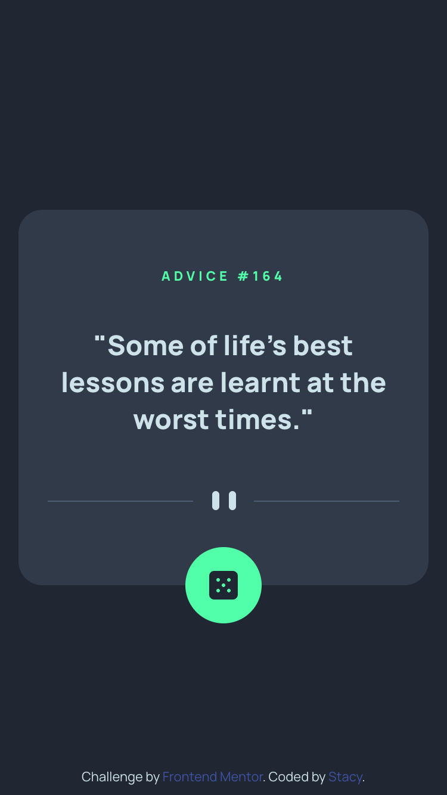

# Frontend Mentor - Advice generator app solution

I always enjoy working with APIs, and this was a simple yet fun challenge to continue learning more about them. This is a solution to the [Advice generator app challenge on Frontend Mentor](https://www.frontendmentor.io/challenges/advice-generator-app-QdUG-13db).

## The challenge

Users should be able to:

- View the optimal layout for the app depending on their device's screen size
- See hover states for all interactive elements on the page
- Generate a new piece of advice by clicking the dice icon

### Built with

```
- Semantic HTML
- BEM naming convention
- CSS Custom Properties
- Advice Slip API
```

## Preview



[Demo](https://your-live-site-url.com)

## Author

- Frontend Mentor - [@stautuan](https://www.frontendmentor.io/profile/stautuan)
